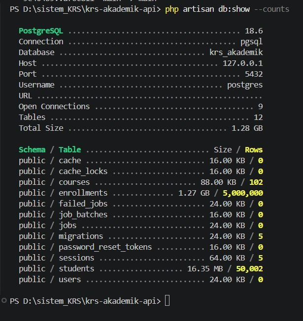

# KRS Akademik

Aplikasi single-page untuk mengelola proses KRS atau pengambilan mata kuliah mahasiswa. Frontend dibangun dengan React + Vite, backend menggunakan Laravel 12, dan database menggunakan PostgreSQL.

Tabel KRS menggunakan server-side pagination sehingga browser hanya menerima data sesuai halaman yang dibuka dan tidak memuat jutaan baris sekaligus.

## Akses Online

| Layanan | URL |
| --- | --- |
| Aplikasi React | [https://krs-akademik.vercel.app](https://krs-akademik.vercel.app) |
| API Laravel | [https://krs-akademik-production.up.railway.app/api/enrollments](https://krs-akademik-production.up.railway.app/api/enrollments) |
| Export CSV | [https://krs-akademik-production.up.railway.app/api/enrollments/export](https://krs-akademik-production.up.railway.app/api/enrollments/export) |
| Repository | [https://github.com/mahirardhr/krs-akademik](https://github.com/mahirardhr/krs-akademik) |

> Deployment publik menggunakan 1.000 data KRS sebagai dataset demonstrasi karena keterbatasan kapasitas layanan hosting. Pengujian skala dilakukan secara lokal menggunakan 5.000.000 baris pada tabel `enrollments`. Seeder terparameterisasi untuk menghasilkan 5 juta data tetap tersedia di repository.

## Fitur

- Create KRS menggunakan mahasiswa dan mata kuliah yang sudah tersedia atau membuat data baru.
- Create melibatkan entitas `students`, `courses`, dan `enrollments` dalam satu transaksi database yang atomic.
- Edit tahun ajaran, semester, dan status enrollment.
- Hard delete enrollment tanpa menghapus mahasiswa dan mata kuliah terkait.
- Live search pada NIM, nama mahasiswa, dan kode mata kuliah dengan debounce 400 ms.
- Quick filter berdasarkan status dan semester.
- Advanced filter untuk seluruh kolom tabel dengan kombinasi logika AND/OR.
- Multi-column ordering secara berurutan.
- Sorting ASC/DESC melalui setiap header tabel dengan indikator urutan.
- Server-side pagination dengan pilihan 10, 25, 50, atau 100 baris per halaman.
- Streaming export CSV untuk seluruh hasil query sesuai filter, bukan hanya halaman aktif.
- Validasi ketat pada frontend, backend, dan database.

## Teknologi

- Frontend: React 19 dan Vite
- Backend: Laravel 12 dan PHP 8.3
- Database: PostgreSQL
- Linting/formatting: Oxlint dan Laravel Pint
- Deployment frontend: Vercel
- Deployment backend dan database: Railway

## Struktur Data

Aplikasi menggunakan tiga tabel akademik utama:

- `students`: data mahasiswa.
- `courses`: data mata kuliah.
- `enrollments`: data pengambilan mata kuliah.

Relasi foreign key:

- `enrollments.student_id` → `students.id`
- `enrollments.course_id` → `courses.id`

Kombinasi berikut dijaga unik agar satu mahasiswa tidak mengambil mata kuliah yang sama dua kali pada periode yang sama:

```text
(student_id, course_id, academic_year, semester)
```

Migration akademik tersedia di:

```text
database/migrations/2026_09_17_112119_create_academic_tables.php
```

## Perilaku Create, Update, dan Delete

### Create dan transaksi atomic

Pengguna dapat memilih mahasiswa/mata kuliah yang sudah ada atau membuat data baru. Backend mencari atau membuat data student dan course, kemudian membuat enrollment dalam satu `DB::transaction()`.

Jika salah satu operasi gagal, seluruh perubahan dibatalkan sehingga tidak meninggalkan data setengah tersimpan dan foreign key tetap valid.

### Update

Update dibatasi pada data enrollment berikut:

- Tahun ajaran
- Semester
- Status

Data identitas mahasiswa dan master mata kuliah tidak diubah melalui form edit enrollment.

### Delete

Aplikasi menggunakan hard delete hanya untuk baris enrollment. Data student dan course terkait tetap disimpan sehingga dapat digunakan kembali pada enrollment lain.

## Prasyarat Lokal

- PHP 8.3 dengan ekstensi `pdo_pgsql` dan `intl`
- Composer
- Node.js dan npm
- PostgreSQL
- Ruang disk yang cukup untuk database dan file CSV besar

## Setup Lokal

Semua perintah backend berikut dijalankan dari folder utama proyek.

### 1. Buat database

Buat database PostgreSQL kosong, misalnya melalui DBeaver:

```sql
CREATE DATABASE krs_akademik;
```

### 2. Siapkan backend

```powershell
composer install
Copy-Item .env.example .env
php artisan key:generate
```

Sesuaikan koneksi PostgreSQL pada `.env`:

```env
DB_CONNECTION=pgsql
DB_HOST=127.0.0.1
DB_PORT=5432
DB_DATABASE=krs_akademik
DB_USERNAME=postgres
DB_PASSWORD=kata_sandi_database
```

Jangan commit file `.env`.

### 3. Jalankan migration

```powershell
php artisan migrate
```

### 4. Pilih ukuran dataset

Atur parameter berikut di `.env` sebelum menjalankan seeder pada database akademik yang masih kosong:

| Tujuan | `KRS_STUDENTS` | `KRS_COURSES` | Jumlah enrollment |
| --- | ---: | ---: | ---: |
| Uji cepat | 100 | 10 | 1.000 |
| Dataset penilaian | 50000 | 100 | 5.000.000 |

Contoh dataset 5 juta:

```env
KRS_STUDENTS=50000
KRS_COURSES=100
```

`DatabaseSeeder` memanggil `AcademicSeeder`. Seeder menggunakan `generate_series` PostgreSQL dan memproses enrollment per batch 500 mahasiswa.

Jalankan:

```powershell
php artisan db:seed
```

> Jalankan seeder hanya pada tabel akademik kosong. Menjalankan ulang data yang sama akan melanggar unique constraint. Jangan menggunakan `migrate:fresh` pada database yang datanya ingin dipertahankan karena perintah tersebut menghapus seluruh tabel.

### 5. Buktikan jumlah data

Jalankan melalui DBeaver atau PostgreSQL client:

```sql
SELECT COUNT(*) AS jumlah_krs FROM enrollments;
```

Hasil pengujian dataset penuh:

```text
jumlah_krs = 5000000
```

Jumlah data juga dapat diperiksa melalui Laravel:

```powershell
php artisan db:show --counts
```

### Bukti pengujian 5 juta data

Pengujian skala penuh dilakukan pada PostgreSQL lokal. Screenshot berikut menunjukkan tabel `enrollments` berisi 5.000.000 baris:



> Deployment publik menggunakan dataset demo yang lebih kecil, sedangkan pengujian performa skala penuh dilakukan secara lokal dengan source code, migration, seeder, dan query yang sama.

### 6. Jalankan backend

```powershell
php artisan serve --host=127.0.0.1 --port=8000
```

### 7. Jalankan frontend

Buka terminal kedua:

```powershell
cd frontend
npm install
npm run dev
```

Buka [http://localhost:5173](http://localhost:5173).

Jika `VITE_API_URL` tidak diatur, `frontend/vite.config.js` meneruskan request `/api` ke Laravel lokal pada `127.0.0.1:8000`.

Untuk menghubungkan frontend lokal ke API Railway, buat `frontend/.env.local`:

```env
VITE_API_URL=https://krs-akademik-production.up.railway.app
```

Restart `npm run dev` setelah mengubah environment variable Vite.

## Endpoint API

| Method | Rute | Fungsi |
| --- | --- | --- |
| GET | `/api/enrollments` | List, search, filter, sorting, dan pagination |
| POST | `/api/enrollments` | Membuat KRS secara transaksional |
| PUT | `/api/enrollments/{id}` | Memperbarui enrollment |
| DELETE | `/api/enrollments/{id}` | Hard delete enrollment |
| GET | `/api/courses/options` | Daftar pilihan mata kuliah |
| GET | `/api/enrollments/export` | Streaming CSV seluruh hasil sesuai filter |

Parameter list utama:

| Parameter | Keterangan |
| --- | --- |
| `page` | Nomor halaman |
| `page_size` | Jumlah baris, maksimal 100 |
| `search` | Live search NIM, nama mahasiswa, dan kode MK |
| `status` | Quick filter status |
| `semester` | Quick filter semester |
| `sort_by` | Kolom sorting dari whitelist |
| `direction` | `asc` atau `desc` |
| `filters` | Kumpulan advanced filter |
| `filter_logic` | `and` atau `or` |
| `orders` | Urutan beberapa kolom |

Quick filter dan pencarian selalu digabung menggunakan AND. Untuk advanced filter:

- `filter_logic=and`: semua kondisi lanjutan harus cocok.
- `filter_logic=or`: minimal satu kondisi lanjutan harus cocok.

Advanced filter tetap digabung dengan quick filter dan pencarian menggunakan AND. Multi-column order diterapkan sesuai urutan parameter `orders`, kemudian `enrollments.id` menjadi urutan terakhir agar hasil stabil.

## Validasi

Validasi dilakukan di frontend dan backend.

### Students

- NIM wajib, unik, 8–12 digit angka, tanpa spasi.
- Nama wajib, 3–100 karakter.
- Email wajib, valid, dan unik.

### Courses

- Kode wajib, unik, dengan pola `[A-Z]{2,4}[0-9]{3}`.
- Nama wajib, 3–120 karakter.
- SKS wajib berupa integer 1–6.

### Enrollments

- Tahun ajaran wajib menggunakan format `YYYY/YYYY`.
- Semester hanya `GANJIL` atau `GENAP`.
- Status hanya `DRAFT`, `SUBMITTED`, `APPROVED`, atau `REJECTED`.
- Kombinasi student, course, tahun ajaran, dan semester tidak boleh duplikat.

Database turut menjaga foreign key, unique constraint, rentang SKS, semester, dan status.

## Advanced Filter dan Multi-Column Order

Advanced filter tersedia untuk tujuh kolom yang ditampilkan:

- NIM
- Nama mahasiswa
- Kode mata kuliah
- Nama mata kuliah
- Semester
- Tahun ajaran
- Status

Beberapa filter dapat digunakan bersamaan dengan logika AND atau OR. Multi-column order dipisahkan dari logika filter: urutan pertama menjadi prioritas utama, dilanjutkan urutan berikutnya.

## Export CSV

Endpoint export menggunakan filter yang sama dengan endpoint list, tetapi tidak membatasi hasil berdasarkan `page` atau `page_size`.

Respons CSV ditulis secara bertahap menggunakan `streamDownload` dan `chunkById(5000)` berdasarkan ID enrollment. Strategi ini mencegah seluruh dataset dimuat sekaligus ke memori PHP. CSV menggunakan UTF-8 BOM agar lebih mudah dibuka dengan Excel.

Microsoft Excel memiliki batas jumlah baris per sheet yang lebih kecil dari 5 juta. File lengkap tetap dapat diperiksa menggunakan text editor untuk file besar, command-line tools, database tools, atau diproses secara bertahap.

## Performa dan Dataset 5 Juta

Pengujian lokal dilakukan menggunakan:

| Tabel | Jumlah data |
| --- | ---: |
| `enrollments` | 5.000.000 |
| `students` | 50.002 |
| `courses` | 102 |

Jumlah student dan course mencakup data tambahan hasil pengujian CRUD.

Hasil pengujian lokal:

| Operasi | Waktu respons |
| --- | ---: |
| Halaman pertama, 25 data | ±975 ms |
| Filter status dan semester | ±595 ms |
| Live search nama mahasiswa | ±1,685 detik |
| Sorting nama mahasiswa | ±926 ms |

Hasil dapat berbeda berdasarkan perangkat, konfigurasi PostgreSQL, kondisi cache, dan resource server.

Strategi performa:

- Pagination dijalankan di backend menggunakan `page` dan `page_size`.
- Respons list dibatasi maksimal 100 baris per halaman.
- Foreign key dan kolom yang sering digunakan untuk filter memiliki index.
- PostgreSQL `pg_trgm` dan GIN index mempercepat pencarian `ILIKE` pada NIM, nama mahasiswa, kode mata kuliah, dan nama mata kuliah.
- Pencarian menentukan ID student/course yang cocok terlebih dahulu sebelum menyaring enrollment.
- Kolom sorting dan filtering dibatasi dengan whitelist.
- Export CSV menggunakan streaming dan `chunkById()`.

## Non-Functional Requirements

### Keamanan dasar

- Semua payload Create dan Update divalidasi oleh Laravel.
- Frontend melakukan validasi untuk memberi umpan balik lebih cepat.
- Query menggunakan Laravel Query Builder dan parameter binding.
- Kolom sorting/filtering dibatasi menggunakan whitelist.
- CORS hanya mengizinkan origin pada `CORS_ALLOWED_ORIGINS`.
- Production menggunakan `APP_DEBUG=false`.
- `.env` dan kredensial tidak disimpan ke Git.

### Kualitas kode

- Backend diformat dan diperiksa menggunakan Laravel Pint.
- Frontend diperiksa menggunakan Oxlint.
- Production build diperiksa menggunakan Vite.
- Migration, seeder, controller, routes, dan komponen React dipisahkan berdasarkan tanggung jawab.

Perintah pemeriksaan:

```powershell
./vendor/bin/pint --test

cd frontend
npm run lint
npm run build
```

### Error handling dan logging

- API mengembalikan HTTP status yang sesuai, termasuk `201`, `404`, dan `422`.
- Payload invalid ditolak backend dengan detail validasi JSON.
- Error validasi ditampilkan kembali pada UI.
- Laravel menggunakan channel logging sesuai konfigurasi environment.

Log lokal tersedia di:

```text
storage/logs/laravel.log
```

Pada Railway, aplikasi menggunakan `LOG_CHANNEL=stderr` sehingga log dapat diperiksa melalui deployment logs.

## Build Frontend

```powershell
cd frontend
npm ci
npm run build
```

Hasil build tersedia pada `frontend/dist`.

## Deployment

### Backend dan PostgreSQL di Railway

Konfigurasi utama:

```env
APP_ENV=production
APP_DEBUG=false
APP_URL=https://krs-akademik-production.up.railway.app
LOG_CHANNEL=stderr
DB_CONNECTION=pgsql
DB_URL=${{Postgres.DATABASE_URL}}
CORS_ALLOWED_ORIGINS=https://krs-akademik.vercel.app
```

Pre-deploy command:

```bash
php artisan migrate --force
```

Seeder demo publik dijalankan dengan:

```env
KRS_STUDENTS=100
KRS_COURSES=10
```

```bash
php artisan db:seed --force
```

Jangan menyimpan `APP_KEY`, `DATABASE_URL`, atau kredensial database di repository.

### Frontend di Vercel

| Pengaturan | Nilai |
| --- | --- |
| Root Directory | `frontend` |
| Framework Preset | Vite |
| Build Command | `npm run build` |
| Output Directory | `dist` |
| Environment Variable | `VITE_API_URL=https://krs-akademik-production.up.railway.app` |

`VITE_API_URL` bersifat publik karena berisi alamat API publik, bukan kredensial.

## Catatan Deployment Publik

Deployment publik sengaja menggunakan dataset demonstrasi 1.000 enrollment agar stabil pada kapasitas hosting yang tersedia. Kemampuan dataset besar diuji lokal menggunakan 5.000.000 enrollment dengan kode migration, seeder, query, index, pagination, dan export yang sama seperti deployment.

Jika kapasitas Railway ditingkatkan, dataset online dapat dibuat ulang menjadi 5 juta dengan parameter seeder tanpa mengubah frontend atau endpoint API.
